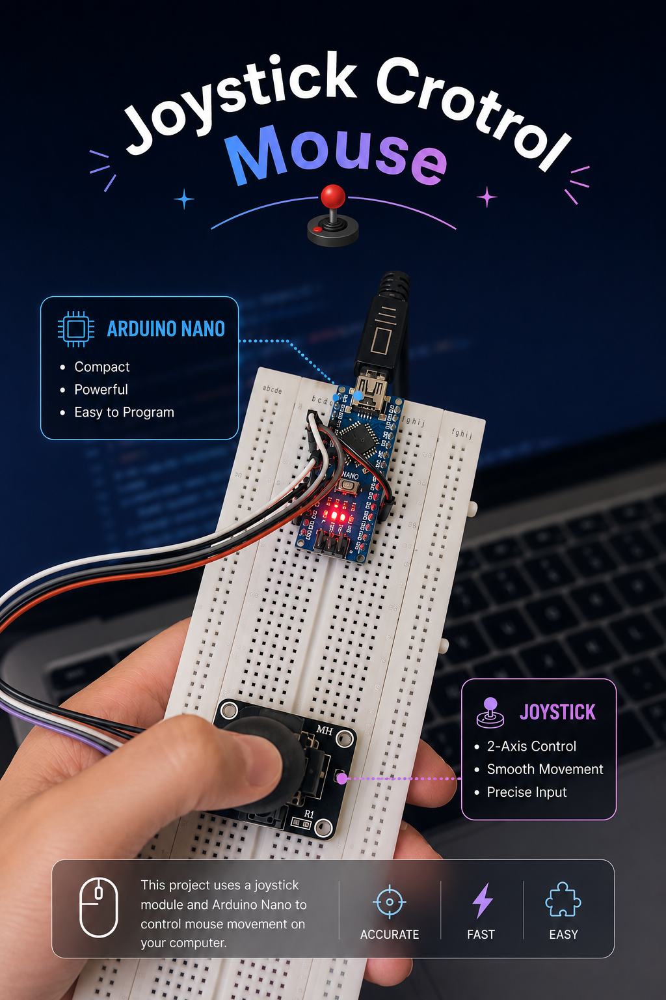
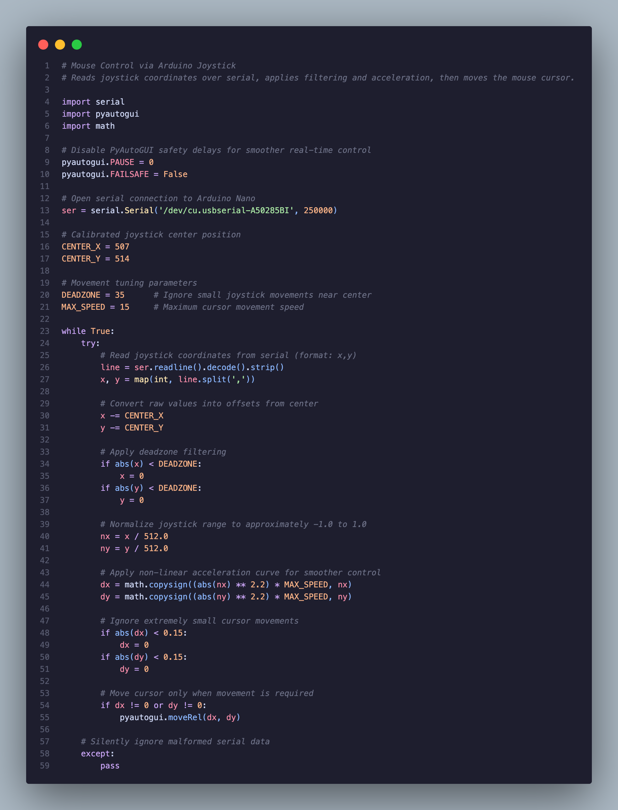

<div align="center">

# Joy Mouse 🖱️

**Transform an Arduino Nano and analog joystick into a responsive desktop pointing device.**

[](https://www.arduino.cc/)
[](https://www.python.org/)
[](https://pyserial.readthedocs.io/)
[](https://pyautogui.readthedocs.io/)
[](LICENSE)
[]()

<br/>



</div>

---

## Overview

Joy Mouse bridges hardware and software by streaming analog joystick data from an Arduino Nano over USB serial, then translating it into precise cursor movement via Python. The pipeline applies deadzone filtering, center calibration, and a non-linear acceleration curve to produce smooth, responsive control.

**Roadmap:** v1.0 Wired → v2.0 Wi-Fi → v3.0 Bluetooth → v4.0 Gesture Control

---

## Features

**v1.0 | Current Release**

- Wired USB joystick control via serial at 250,000 baud
- Deadzone filtering to eliminate cursor drift at rest
- Center calibration for accurate neutral position mapping
- Non-linear acceleration curve (power 2.2) for precision at low displacement and speed at full range
- Lightweight Python implementation with minimal dependencies
- Arduino Nano based: compact, affordable, and widely available

---

## Hardware

| Component | Purpose |
|---|---|
| Arduino Nano | Reads joystick axes and streams serial data |
| Analog Joystick Module | 2-axis input producing 0-1023 analog values |
| Breadboard | Prototyping without soldering |
| Jumper Wires | Connecting joystick to Arduino pins |
| USB Cable | Powers the Arduino and carries serial data |

---

## Software

| Dependency | Version | Purpose |
|---|---|---|
| Python | 3.x | Runtime for the mouse controller |
| PySerial | Latest | Serial communication with Arduino |
| PyAutoGUI | Latest | Cross-platform cursor movement |
| Arduino IDE | 1.x / 2.x | Compiling and uploading the sketch |

```bash
pip install pyserial pyautogui
```

---

## Project Structure

```
JoystickMouse/
|
+-- JoystickMouse.ino          # Arduino sketch: reads joystick, sends serial data
+-- JoystickControlMouse.py    # Python controller: applies filtering and moves cursor
+-- Pic.PNG                    # Project hardware photo
+-- code.png                   # Code reference screenshot
+-- .gitignore                 # Python and Arduino ignore rules
+-- LICENSE                    # MIT License
+-- README.md
```

---

## Arduino Sketch

**File:** `JoystickMouse.ino`

Reads joystick X/Y axis values every 5 ms and transmits them as `x,y\n` pairs at 250,000 baud.

```cpp
// Arduino Nano Joystick Reader
// Reads analog joystick X/Y positions and sends them over Serial for mouse control.

const int VRX = A0; // Joystick X-axis pin
const int VRY = A1; // Joystick Y-axis pin

void setup() {
  Serial.begin(250000);
}

void loop() {
  int x = analogRead(VRX);
  int y = analogRead(VRY);

  Serial.print(x);
  Serial.print(",");
  Serial.println(y);

  delay(5); // ~200 readings/second
}
```

---

## Python Controller

**File:** `JoystickControlMouse.py`

Reads the serial stream, applies filtering and acceleration, and moves the cursor via `pyautogui`.

```python
import serial
import pyautogui
import math

pyautogui.PAUSE = 0
pyautogui.FAILSAFE = False

ser = serial.Serial('/dev/cu.usbserial-A50285BI', 250000)

CENTER_X = 507
CENTER_Y = 514
DEADZONE = 35
MAX_SPEED = 15

while True:
    try:
        line = ser.readline().decode().strip()
        x, y = map(int, line.split(','))

        x -= CENTER_X
        y -= CENTER_Y

        if abs(x) < DEADZONE: x = 0
        if abs(y) < DEADZONE: y = 0

        nx = x / 512.0
        ny = y / 512.0

        dx = math.copysign((abs(nx) ** 2.2) * MAX_SPEED, nx)
        dy = math.copysign((abs(ny) ** 2.2) * MAX_SPEED, ny)

        if abs(dx) < 0.15: dx = 0
        if abs(dy) < 0.15: dy = 0

        if dx != 0 or dy != 0:
            pyautogui.moveRel(dx, dy)
    except:
        pass
```

---

## Circuit Connections

| Joystick Pin | Arduino Nano Pin | Notes |
|---|---|---|
| VCC | 5V | Power supply |
| GND | GND | Ground |
| VRX | A0 | X-axis analog output |
| VRY | A1 | Y-axis analog output |
| SW | Not connected | Button pin, reserved for future use |

> The `SW` pin can be wired to a digital pin (e.g. `D2`) to add click functionality in future versions.

---

## ⚙️ Installation

**1. Clone the repository**

```bash
git clone https://github.com/MohammadFayasKhan/joy-mouse.git
cd joy-mouse
```

**2. Install Python dependencies**

```bash
pip install pyserial pyautogui
```

**3. Flash the Arduino**

- Open `JoystickMouse.ino` in Arduino IDE
- Board: `Arduino Nano` | Processor: `ATmega328P`
- Select the correct port under `Tools > Port`
- Click **Upload**

**4. Find your serial port**

```bash
# macOS / Linux
ls /dev/cu.*        # macOS
ls /dev/ttyUSB*     # Linux

# Windows -> check Device Manager under Ports (COM & LPT)
```

**5. Set the port in the Python script**

```python
# JoystickControlMouse.py, line 13
ser = serial.Serial('/dev/cu.usbserial-XXXXXXXX', 250000)
#                   ^-- replace with your actual port
```

---

## 🚀 Usage

```bash
python JoystickControlMouse.py
```

- Move the joystick in any direction → cursor moves
- Return to center → cursor stops (deadzone active)
- Push further from center → cursor accelerates
- Press `Ctrl+C` to stop

---

## How It Works

**Serial Communication**
The Arduino transmits `x,y` pairs over USB at 250,000 baud (~200 readings/second). Python reads each line with `ser.readline()`.

**Center Calibration**
Raw axis values are offset by the calibrated center (`CENTER_X = 507`, `CENTER_Y = 514`), converting absolute readings into directional deltas.

**Deadzone Filtering**
Any delta within ±35 units of center is clamped to zero, eliminating drift caused by mechanical jitter when the stick is at rest.

**Dynamic Acceleration**
The normalized offset is raised to the power of 2.2, producing a non-linear response curve:

```
speed = |offset|^2.2 x MAX_SPEED
```

Small nudges produce slow, precise movement. Full displacement produces fast, sweeping movement.

**Cursor Movement**
`pyautogui.moveRel(dx, dy)` applies the calculated delta. Sub-0.15 pixel movements are suppressed to avoid sub-pixel noise.

---

## 📦 Roadmap

| Version | Edition | Status | Highlight |
|---|---|---|---|
| v1.0 | Wired | Released | USB serial via PySerial |
| v2.0 | Wi-Fi | Planned | ESP8266 / ESP32 wireless |
| v3.0 | Bluetooth | Planned | BLE HID protocol |
| v4.0 | Gesture Control | Planned | IMU / camera input |

**Progression:** v1.0 Wired → v2.0 Wi-Fi → v3.0 Bluetooth → v4.0 Gesture Control

---

## Screenshots




---

## Contributing

1. Fork the repository
2. Create a feature branch: `git checkout -b feature/your-feature`
3. Commit your changes: `git commit -m 'feat: description'`
4. Push and open a Pull Request

Contribution ideas: click support via `SW` pin, scroll wheel simulation, config file for port/deadzone/speed settings, v2.0 Wi-Fi implementation.

---

## License

MIT License. See [LICENSE](LICENSE) for details.

---

## Author

**Mohammad Fayas Khan**

GitHub → [MohammadFayasKhan](https://github.com/MohammadFayasKhan)

*Built for learning, experimentation, and embedded systems exploration.*
